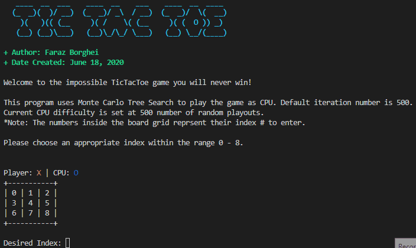

# AI-TicTacToe

Python3 implementation of AI TicTacToe using Monte Carlo Tree Search (MCTS)



## Setup & Installation
```sh
$ git clone https://github.com/faraz-b/AI-TicTacToe.git

$ python3 TicTacToe.py
```

Optionally, you can provide a custom CPU difficulty by supplying a -d or --difficulty parameter

This sets the number of random playouts the CPU will perform to determine the best index choice

```sh
$ python3 TicTacToe.py -d 30
```